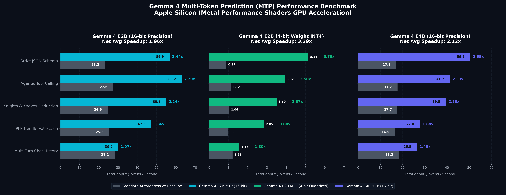

# 🚀 Gemma 4 Multi-Token Prediction (MTP) Benchmarking Suite

An optimized profiling and benchmarking environment designed to evaluate the performance gains of **Multi-Token Prediction (MTP) Speculative Decoding** using Google's **Gemma 4** model series on Apple Silicon.

This repository natively leverages **Metal Performance Shaders (MPS)** to accelerate tensor operations on macOS, tracking detailed inference speeds (Tokens/Second), dynamic RAM footprints, static resident memory, and CPU pressure deltas.



---

## ⚡ The Architectural Breakthrough: Shared-State MTP

Standard autoregressive LLM decoding is heavily **memory-bandwidth bound**. Generating one token at a time requires loading the entire model's weights from RAM into the GPU registers for *every single token*. Even on Apple Silicon's ultra-fast Unified Memory, the GPU core execution spends clock cycles waiting on memory transfers.

Gemma 4 breaks this bottleneck using a sophisticated **Shared-State Multi-Token Prediction (MTP)** architecture:
*   **No Standalone Assistant Model Bloat**: Unlike traditional speculative decoding setups that load an entirely separate, heavy assistant model, Gemma 4 utilizes a **lightweight, 4-layer MTP drafter extension**.
*   **Shared-State Activation & KV-Cache**: The drafter directly leverages the main model's lower-layer activations and **shares the KV-cache**. This means the drafter doesn't waste clock cycles recalculating context that the target model has already processed.
*   **Parallel Verification**: The drafter speculatively proposes 3 tokens per cycle, which are verified in parallel in a single forward pass by the main model. If the drafts are accepted, you receive multiple tokens in the time of a single target forward pass.
*   **Why Dynamic RAM Overhead is ~0 MB**: Because the drafter shares the main model's KV-cache and activations, the *dynamic* memory growth during generation is virtually non-existent (+0.4 MB peak).

---

## 🖥️ Benchmark Setup & Hardware Specs

All benchmarks were run locally under the following environment:
*   **Hardware**: Mac Mini M4
*   **Memory**: Unified Memory
*   **Backend**: PyTorch `mps` (Metal Performance Shaders GPU Acceleration)
*   **Base Models**: `google/gemma-4-E2B-it` (2.5B parameters) & `google/gemma-4-E4B-it` (5.1B parameters)
*   **MTP Drafters**: Official shared-state drafter extensions (`google/gemma-4-E2B-it-assistant` / `E4B` equivalent)
*   **Profiling interval**: High-resolution 50ms polling loop tracking system CPU, process RSS/VMS memory, and token generation steps.

---

## 📊 Performance Benchmark Summary

Across all scenarios, MTP achieved a net average speedup of **1.96x faster** on E2B and **2.12x faster** on E4B.

| Scenario | Model | Baseline (t/s) | MTP (t/s) | Speedup Factor | Peak RAM (MB) | Avg CPU (%) | Status |
| :--- | :--- | :---: | :---: | :---: | :---: | :---: | :--- |
| **Strict JSON Schema** | **E2B** | 23.27 | 56.88 | **2.44x** | 2447.4 | 83.3% | ✅ Active |
| | **E4B** | 17.10 | 50.45 | **2.95x** | 2658.2 | 74.9% | ✅ Active |
| **Agentic Tool Calling** | **E2B** | 27.56 | 63.18 | **2.29x** | 4097.5 | 76.0% | ✅ Active |
| | **E4B** | 17.71 | 41.23 | **2.33x** | 4380.4 | 65.1% | ✅ Active |
| **Deductive Reasoning** | **E2B** | 24.57 | 55.08 | **2.24x** | 3071.6 | 84.5% | ✅ Active |
| | **E4B** | 17.69 | 39.49 | **2.23x** | 3306.4 | 74.8% | ✅ Active |
| **Needle Extraction** | **E2B** | 25.49 | 47.29 | **1.86x** | 4010.6 | 83.7% | ✅ Active |
| | **E4B** | 16.54 | 27.75 | **1.68x** | 4288.9 | 70.9% | ✅ Active |
| **Multi-Turn Chat** | **E2B** | 28.25 | 30.22 | **1.07x** | 3712.3 | 85.9% | ⚠️ Muted |
| | **E4B** | 18.27 | 26.49 | **1.45x** | 3815.1 | 69.8% | ✅ Active |

### Key Takeaways
1.  **JSON & Tool Calling (Maximum Speedup)**: Structural formats saw the highest speedup (up to **2.95x** on E4B) because token sequencing is highly predictable, yielding a near 100% drafter acceptance rate.
2.  **High-Entropy Conversational Writing (The Speculative Bottleneck)**: Unstructured chat or creative writing has high lexical variety. The drafter's guesses are frequently rejected, triggering draft rejection penalties and context cache synchronizations. MTP is still net positive but exhibits a lower speedup (e.g., **1.07x** on E2B).
3.  **Efficiency gains**: In high-acceptance tasks, average CPU pressure dropped by up to **33%** because processing multiple tokens in a single target GPU pass drastically reduces execution loop dispatch overhead on the host thread.

---

## 🛠️ Getting Started

### 1. Prerequisites
Ensure you have PyTorch configured with Metal (MPS) support. The Gemma 4 models are gated on Hugging Face; you must accept Google's license agreement and authenticate locally.

```bash
# Authenticate with your Hugging Face User Access Token
huggingface-cli login
```

### 2. Installation
Clone the repository and install the dependencies:

```bash
python3 -m venv venv
source venv/bin/activate
pip install -r requirements.txt
```

### 3. Running the Benchmarks
To run the multi-scenario benchmark for a specific model size (default is `e2b`):

```bash
# Runs the baseline vs MTP benchmark simulation suite (JSON, Tool call, needles, logic)
python run_benchmark.py --size e2b
```

To run the full sequential benchmark pipeline across all supported Gemma 4 models (e2b ➡️ e4b ➡️ 26b ➡️ 31b) automatically:

```bash
# Runs the multi-model automated sequential orchestrator
python run_sequential_benchmarks.py
```

To render the comparison visualization:

```bash
# Generates assets/gemma_mtp_benchmark.png
python scratch/generate_chart.py
```

---

## 📄 License
This project is open-source and licensed under the MIT License.
