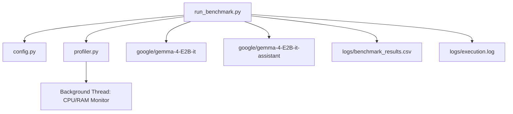

# Gemma 4 E2B MTP Inferencing Benchmark Plan

This project implements a Python-based profiling and benchmarking environment to evaluate the performance gains of **Multi-Token Prediction (MTP)** using the `google/gemma-4-E2B-it` model on Apple Silicon / macOS.

We will benchmark two inference states:
1. **Baseline**: `google/gemma-4-E2B-it` (Standard autoregressive generation).
2. **MTP (Speculative Decoding)**: `google/gemma-4-E2B-it` + `google/gemma-4-E2B-it-assistant` (Lightweight assistant-assisted generation).

We will capture generation latency, throughput (tokens/second), CPU pressure, and memory footprint, logging the metrics to structured CSV and log files.

---

## User Review Required

> [!IMPORTANT]
> **Hugging Face Model Access**: The Gemma 4 model series is gated. Before running the benchmark, you must accept Google's license agreement for both `google/gemma-4-E2B-it` and `google/gemma-4-E2B-it-assistant` on Hugging Face.
> Furthermore, you must authenticate in your terminal using:
> `huggingface-cli login` or set the `HF_TOKEN` environment variable.

> [!NOTE]
> **Hardware Support**: On your macOS system, we will natively leverage **Metal Performance Shaders (MPS)** via PyTorch (`device="mps"`) to speed up inference and reflect realistic Apple Silicon GPU acceleration. Standard CPU execution will also be supported as a fallback.

---

## Open Questions

> [!IMPORTANT]
> 1. **Model Access & Environment**: Do you have a Hugging Face User Access Token ready with access to Gemma 4? We will construct the script to check and alert you if the token is missing.
> 2. **Quantization Requirements**: The target model `google/gemma-4-E2B-it` occupies ~10GB of VRAM/RAM in FP16 (5.1B total parameters). When using MTP, loading both the target and assistant models requires ~12GB of VRAM/RAM. Should we include optional 8-bit or 4-bit loading via Hugging Face parameters (using standard `torch_dtype=torch.float16` or `device_map="auto"`) to prevent memory overflow if system memory is highly constrained?

---

## Proposed Changes

We will build this prototype in `/Users/pank/Experiments/MTP` using a modular Python structure.

### [MTP Project Workspace]

#### [NEW] [requirements.txt](file:///Users/pank/Experiments/MTP/requirements.txt)
Specifies necessary PyTorch, Hugging Face `transformers`, `huggingface_hub`, and system monitoring dependencies.
- `torch>=2.2.0` (with MPS support)
- `transformers>=4.45.0` (for MTP / speculative decoding support)
- `huggingface_hub`
- `psutil` (for high-fidelity CPU/Memory resource tracking)
- `pandas` & `tabulate` (for CSV export and clean terminal tables)

#### [NEW] [config.py](file:///Users/pank/Experiments/MTP/config.py)
A central configuration module containing model paths, device configuration, test prompts, and benchmarking parameters.
- Target Model ID: `google/gemma-4-E2B-it`
- Assistant Model ID: `google/gemma-4-E2B-it-assistant`
- Test parameters: `max_new_tokens`, `temperature`, `top_p`.
- A representative array of standard prompts (short reasoning, coding, long text generation) to measure speed across different output length brackets.

#### [NEW] [profiler.py](file:///Users/pank/Experiments/MTP/profiler.py)
An asynchronous system-level resource profiler.
- Utilizes `psutil` to capture:
  - System and process CPU utilization (`%`).
  - RSS (Resident Set Size) memory footprint (`MB`).
  - VMS (Virtual Memory Size) footprint (`MB`).
- Spawns a lightweight daemon thread to sample statistics at regular intervals (e.g., every 50ms) during LLM generation.
- Computes aggregated summaries post-generation: baseline/idle resource consumption, peak memory usage, and average CPU pressure.

#### [NEW] [run_benchmark.py](file:///Users/pank/Experiments/MTP/run_benchmark.py)
The core controller script that coordinates the entire benchmark run.
- **Inference Handlers**:
  - `run_baseline()`: Loads the main model and runs prompt tests, reporting speed & resource footprint.
  - `run_mtp()`: Loads target + assistant models, executes speculative generation, and tracks metrics.
- **Warm-up phase**: Executes a throwaway warm-up prompt on both models to eliminate initial model-loading/compilation spikes from the results.
- **Metrics Evaluator**: Logs inference parameters, tokens generated, time to first token (TTFT), tokens per second (t/s), peak memory, and average CPU usage.
- **Aggregator & Log Generator**:
  - Outputs full results into `logs/benchmark_results.csv`.
  - Outputs detailed progress info to `logs/execution.log`.
  - Displays a premium, well-formatted terminal comparison table comparing Baseline vs. MTP speedups and resource costs.

---

## Verification Plan

### Automated Tests
- Run environment check to verify PyTorch has `mps` support enabled and Hugging Face authentication is active.
- Execute the profiler locally for a dummy operation to ensure accurate polling of memory and CPU stats without interfering with Python's main GIL.
- Run `run_benchmark.py` with small dummy models (e.g., `facebook/opt-125m` vs `facebook/opt-125m` as assistant) to verify the plumbing works end-to-end prior to downloading large Gemma 4 weights.

### Manual Verification
- Execute `python run_benchmark.py` to fetch Gemma 4 models and run the complete test suite.
- Inspect the generated `logs/benchmark_results.csv` and `logs/execution.log` to confirm logging integrity.
- Review the final comparison report displaying inference speed improvements versus CPU/Memory consumption overhead.
